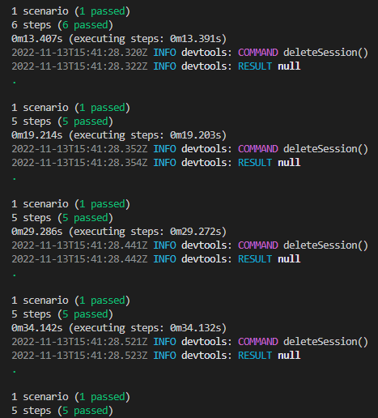
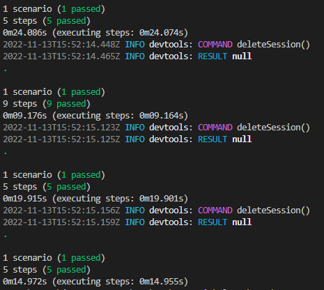
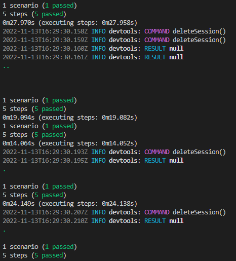
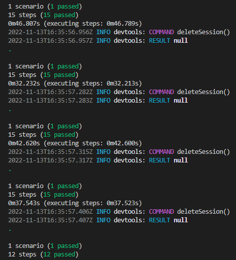

# Kraken testing in web app

## Requirement

*  [Ghost installed and running](https://ghost.org/docs/install/local/)
*  [Chai assertion](https://www.chaijs.com/guide/installation/)
*  [Kraken](https://thesoftwaredesignlab.github.io/Kraken/)

## Steps to run the test

1. Go to the Ghost-Kraken folder.
2. For some reason, kraken is running the first feature it finds. What was done was to leave only the feature we were going to test in the project.
3. Execute tests
    ```sh        
    npm install kraken-node        // in case of error
    npm install -g appium          // in case of error
    npm install chai               // in case of error
    kraken-node run
    ```
4. Watch e2e test running.

## Explanation of code

1. Inside the features folder are the createAccount, register, login, profile, forgot and dashboard features in Gherkin language.

2. Inside the web/step-definitions folder is the index.js file. This file serves as a bridge between our test specification in the .feature and driver files.

3. Inside the web/step-definitions folder is the index.js file. This file serves as a bridge between our test specification in the .feature and driver files.

4. For some reason, kraken is running the first feature it finds. What was done was to leave only the feature we were going to test in the project.

5. In reports are some results of latest tests.

## Evidence

### Ghost running
 

### Create Account
 

### Forgot
 

### Login
 

### Dashboard
 

### Profile
 

#### By students Jorge, Rodolfo, Luis, Steven
